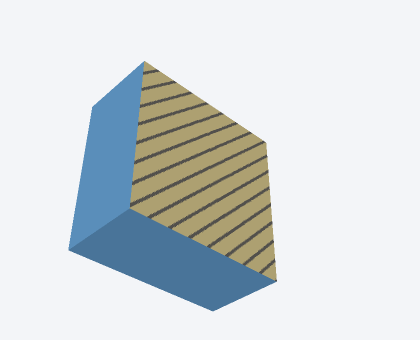
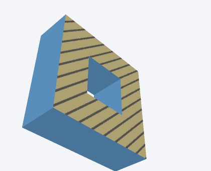
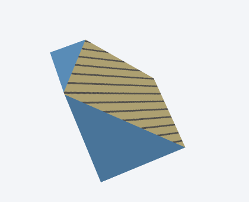

# gltf-slice

Slice static glTF/GLB meshes into section views and close each cut surface with
a diagonal hatch texture.

| Axis-aligned slice | Hole-aware cap | Transformed mesh |
| --- | --- | --- |
|  |  |  |

## Install

```sh
bun add github:tscircuit/gltf-slice
```

The package is source-first TypeScript and targets Bun or a modern TypeScript
toolchain.

## Slice a GLB in memory

```ts
import { readFile, writeFile } from "node:fs/promises"
import { sliceGLB } from "gltf-slice"

const input = await readFile("model.glb")
const output = await sliceGLB(input, {
  plane: "xy",
  zOffset: 10,
  side: "z+",
})

await writeFile("model-section.glb", output)
```

`side` names the half-space retained in the output. In this example, geometry
with `z >= 10` is retained, and the cap's outward face points toward `z-`.

## Slice files

The input and output formats are selected from their `.gltf` or `.glb`
extensions. External buffers and images referenced by JSON glTF inputs are
loaded and rewritten automatically.

```ts
import { sliceGltfFile } from "gltf-slice"

const stats = await sliceGltfFile(
  "model.gltf",
  "model-section.glb",
  { plane: "yz", xOffset: 4.5, side: "x-" },
)

console.log(stats.capTriangles, stats.capLoops)
```

For an in-memory JSON glTF package, use `sliceGLTF()` with a glTF Transform
`JSONDocument` (`{ json, resources }`). Lower-level callers can use
`sliceDocument()` directly.

## CLI

```sh
bunx gltf-slice model.glb section.glb \
  --plane xy \
  --z-offset 10 \
  --side z+
```

Run `gltf-slice --help` for all options, including generic offsets, cap
disablement, hatch spacing, hatch line width, and geometry tolerance.

## Slice syntax

| Plane | Per-axis offset | Valid retained sides |
| --- | --- | --- |
| `"xy"` | `zOffset` | `"z+"`, `"z-"` |
| `"xz"` | `yOffset` | `"y+"`, `"y-"` |
| `"yz"` | `xOffset` | `"x+"`, `"x-"` |

Every plane also accepts the shorter `offset` property. The default offset is
zero in the model's coordinate system.

## Customize the section hatch

```ts
const output = await sliceGLB(input, spec, {
  hatch: {
    size: 128,
    spacing: 12,
    lineWidth: 2,
    background: [255, 238, 232, 255],
    lineColor: [170, 34, 34, 255],
  },
  capMaterialName: "machined interior",
})
```

The hatch is embedded as a PNG base-color texture, so it remains visible in
ordinary glTF viewers and in exported GLB files. Caps support disconnected
solids and nested loops such as holes in tubes.

## Geometry behavior

- The slice plane is evaluated in world coordinates, including nested node
  transforms, rotation, and non-uniform scale.
- Shared mesh instances are sliced independently because each instance can
  intersect the world-space plane differently.
- Vertex attributes are interpolated at cut edges; normals and tangents are
  normalized after interpolation.
- Triangle primitives are sliced. Non-triangle primitives are preserved.
- Input meshes should be watertight to produce closed cap loops. Open cut
  chains are reported in `SliceStats.openChains` and are left uncapped.
- Skins and morph targets must be baked before slicing. Compressed mesh
  extensions should be decoded before passing the asset to this package.

## Development

```sh
bun install
bun run check
```

The test suite includes 18 committed PNG snapshots rendered with
[PoppyGL](https://github.com/tscircuit/poppygl), covering every axis and side,
offsets, holes, multiple solids, nested transforms, uncapped output, and hatch
styles. PoppyGL renders in native JavaScript without WebGL, keeping visual
checks deterministic in CI.
